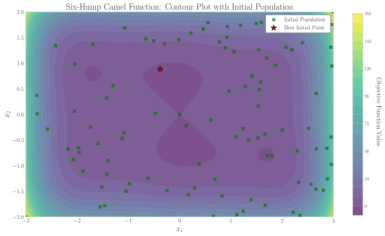
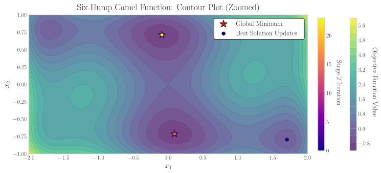

# Summary

`GlobalSearch-rs` is an open-source global optimization library written in Rust that implements a multistart optimization strategy. It is based on the `OptQuest/NLP (OQNLP)` algorithm, combining scatter search metaheuristics with local nonlinear programming (NLP) solvers. The software is designed to solve nonlinear global optimization problems by leveraging Rust's built-in guarantees for safe and efficient parallel computing. Additionally, `GlobalSearch-rs` provides Python bindings, allowing seamless integration with Python-based workflows, making it a versatile tool for working in scientific computing and data-driven optimization tasks. This library provides an alternative to proprietary solutions like MATLAB's `GlobalSearch`, offering a high-performance, open-source alternative accessible to the scientific and engineering communities.

# Statement of need

Global optimization is a fundamental problem in engineering, physics, and applied mathematics, where objective functions often exhibit multiple local minima. The existing `OQNLP` algorithm [@ugray] effectively balances exploration (broad exploration of the search space) and exploitation (local refinement of promising regions) by employing a multi-start strategy with scatter search and local optimization.

Building on these algorithmic advances, practical software implementations have become essential for researchers and engineers. MATLAB’s `GlobalSearch`, for example, has been widely adopted, with applications ranging from airfoil design optimization [@airfoil] to kinetic mechanism analysis of polyurethane decomposition [@kinetics]. However, despite its popularity, to the best of our knowledge, no actively maintained open-source alternative that implements the `OQNLP` algorithm currently exists. The only open-source implementation, `MEIGO` [@meigo], is still written in MATLAB, a proprietary language, limiting accessibility.

Several high-quality open-source optimization libraries are available, such as `NLopt` [@nlopt], which provides both Rust and Python bindings. This library offers a broad collection of local and global optimization algorithms. However, it does not provide an implementation of the `OQNLP` algorithm specifically.

`GlobalSearch-rs` addresses this gap and extends its functionality with additional features designed to improve practical usability. It offers a modern, high-performance implementation for bound-constrained nonlinear programming (NLP) problems:

$$
\begin{aligned}
\underset{x \in \mathbb{R}^n}{\text{minimize}} \quad & f(x) \\\text{s. t.} \quad & l_i \leq x_i \leq u_i, \quad i = 1, \ldots, n
\end{aligned}
$$

Developed in Rust—a free and open-source programming language—it combines accessibility with performance, ensuring that researchers are not limited by proprietary ecosystems.
Rust's ownership model and concurrency features enable safe and efficient execution, making the library suitable for high-performance computing applications, a claim further supported by recent work demonstrating Rust's advantages in high-performance computing [@eth-rust].

\autoref{fig:logos} shows the logos of the two packages introduced in this work.

# Library features

`GlobalSearch-rs` implements scatter search metaheuristics, which balance diversification (generation of a collection of diverse trial solutions) and intensification (deeper search around promising areas) strategies to navigate complex objective landscapes [@Laguna2005]. By leveraging these techniques, the algorithm increases the probability of locating the true global minimum compared to simple local search methods, which can easily become trapped in local optima. However, as with other stochastic global optimization algorithms, `GlobalSearch-rs` cannot guarantee that the best solution found is the true global minimum. Instead, it aims to identify high-quality solutions with high probability. Users can increase confidence by performing multiple independent runs or using different random seeds.

The library integrates with both the `cobyla` [@cobyla] and `argmin` [@argmin] crates. These Rust-based optimization libraries provide a range of local NLP solvers. Supported methods include COBYLA, LBFGS, Nelder-Mead, Steepest Descent, Newton-Conjugate-Gradient and Trust Region solvers, ensuring flexibility in handling different types of objective functions [@drones7080487].

Parallel execution is a core feature of `GlobalSearch-rs`, utilizing the `Rayon` library to distribute computation across multiple threads. This has the potential of significant reductions in elapsed (wall-clock) time, enabling users to tackle large-scale optimization problems with improved completion time compared to single-threaded alternatives. To further support long-running tasks, the library provides checkpointing capabilities, allowing users to save and resume optimization states without restarting from scratch.

As an open-source and cross-platform library, `GlobalSearch-rs` is designed to be accessible to researchers and engineers from various fields. The Python bindings, created using `PyO3` and `maturin`, enable users to leverage its capabilities within Python-based numerical and data science environments (e.g., `NumPy` [@numpy], `JAX` [@jax]), making it a practical choice for interdisciplinary research and engineering applications.

The software is distributed under the permissive MIT license, encouraging use, modification, and contribution from the community. To ensure reliability and maintain quality, continuous integration testing is performed via GitHub Actions, providing automated validation of builds and functionality across supported platforms.

# Example: Optimizing the Six-Hump Camel Function

To illustrate a concrete use case, let's consider a common benchmark problem in global optimization: the two-dimensional Six-Hump Camel function. The function is defined in \autoref{eq:sixhumpcamel}. It is continuous, differentiable and non-convex.

\begin{equation}\label{eq:sixhumpcamel}
f(x) = \left(4 - 2.1 x_1^2 + \frac{x_1^4}{4} \right)x_1^2 + x_1 x_2 + (-4 +4 x_2^2)x_2^2
\end{equation}

The function is evaluated in the domain (bounds) $x_1 \in [-3, 3]$ and $x_2 \in [-2, 2]$. It has
two global minima at approximately $\mathbf{x}^*_{\pm} \approx (\pm 0.0898, \mp 0.7126)$ with a function value of $f(\mathbf{x}^*_{\pm}) \approx -1.0316$.

The `GlobalSearch-rs` algorithm solves this problem in two stages. In the first stage, it explores the search space by generating an initial population of candidate solutions within the prescribed bounds, forming a reference set. In the second stage, it performs local optimization from a subset of promising points in this reference set to refine the search and converge toward local (and potentially global) optima.

\autoref{fig:ex-reference-set} presents the contour plot of the Six-Hump Camel function alongside the initial distribution of candidate solutions generated in stage one.

The orange diamond marks the best candidate in the initial population, used as the starting point for the first local optimization.

The algorithm then enters the stage two, where it performs local optimization on the selected reference set points that have been identified as promising (i.e. those within the merit and distance thresholds). \autoref{fig:ex-stage-two} shows the contour plot and surface of the function colored by the stage two iteration number.

The algorithm successfully finds both global minima of the Six-Hump Camel function.

# Conclusion

`GlobalSearch-rs` provides a robust and accessible open-source framework for nonlinear global optimization. By combining parallelization, flexible local solvers, and Python integration, it offers a compelling alternative to proprietary tools. The Rust implementation ensures efficiency and reliability, supporting transparent and reproducible optimization workflows across scientific and engineering domains. This tool advances the state of open-source global optimization by delivering a modern and extensible solution for complex problems.

# References